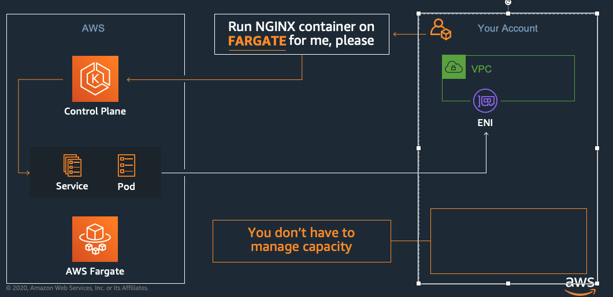
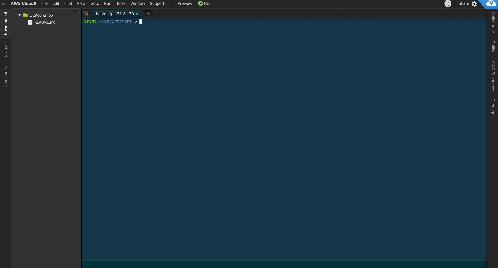
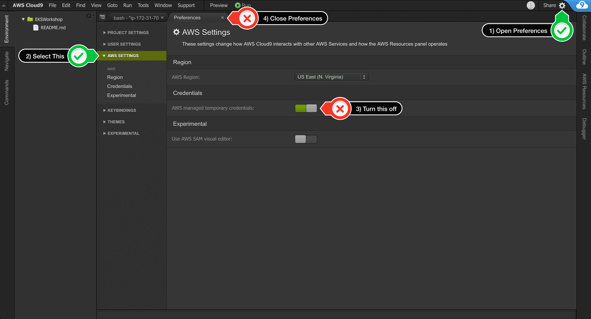

**Disclaimer**:
This lab is provided as part of AWS Summit Online. 
  ℹ️  You will run this lab in your **own** AWS account. Please follow directions at the end of the lab to remove resources to avoid future costs.
# EKS FARGATE DEV LAB


**Time**: ~ 1 hour.  
**Mandatory Requirement**: AWS Account with Admin access


[AWS Fargate](https://docs.aws.amazon.com/eks/latest/userguide/fargate.html) is a technology that provides on-demand, right-sized compute capacity for containers. With AWS Fargate, you no longer have to provision, configure, or scale groups of virtual machines to run containers. This removes the need to choose server types, decide when to scale your node groups, or optimize cluster packing. You can control which pods start on Fargate and how they run with [Fargate profiles](https://docs.aws.amazon.com/eks/latest/userguide/fargate-profile.html), which are defined as part of your Amazon EKS cluster.
1
In this lab, we will deploy a replica set of NGINX pods on EKS Fargate.



### Setup Cloud 9 for eks cluster launch:

* Log in to the [AWS console](https://aws.amazon.com/console/) with **admin** privileges. And ensure that you are in the region that supports EKS Fargate.
    * AWS Fargate with Amazon EKS is currently only available in the following Regions: **us-east-1**, **us-east-2**, **us-west-2**, **ap-northeast-1**, **eu-west-1** , **eu-west-1**,  **ap-southeast-2**, **ap-southeast-1**, . Pods running on Fargate are supported on EKS clusters beginning with Kubernetes version 1.14 and platform version eks.5. For this lab, we’ll pick **ap-southeast-2**
* Go to Services → [Cloud9](https://ap-southeast-2.console.aws.amazon.com/cloud9/home?region=ap-southeast-2)
* Create Environment 
* Name: **EKS Fargate Dev Lab**
* choose an instance size. If you want to use the free tier VM, like t2.micro, you can use it but setup might become too slow. **You can use T3.small**. Recommend instance size: **Other Instance Type**s → **T3.large or you can use T3.small**
* Leave everything default and press “**Next Step**”
* Click on “**Create Environment**”
* Once Cloud9 has spun up you can close the welcome window and other terminal windows you see in the pane and launch a new terminal by going to **Window** → **New Terminal**

* *Note: If you like this theme, you can choose it yourself by selecting View / Themes / Solarized / Solarized Dark in the Cloud9 workspace menu.*
* Next, we’ll be turning off temporary AWS credentials because we don’t want to use the Cloud9 credentials to launch the EKS Fargate cluster. We’ll be using an “admin” role assigned to the Cloud9 EC2 instances to configure the cluster.
    * click the gear icon (in top right corner), or click to open a new tab and choose “Open Preferences”
    * Select **AWS SETTINGS**
    * Turn off **AWS managed temporary credentials**
    * Close the **Preferences** tab
    
    * To ensure temporary credentials aren’t already in place we will also remove any existing credentials file: 

            `rm -vf ${HOME}/.aws/credentials`

* Let’s create an IAM role with admin privileges for your Cloud9 Workspace and assign it to the EC2 instance running cloud9.
    * Follow [this deep link to create an IAM role with Administrator access.](https://console.aws.amazon.com/iam/home#/roles$new?step=review&commonUseCase=EC2%2BEC2&selectedUseCase=EC2&policies=arn:aws:iam::aws:policy%2FAdministratorAccess)
    * Confirm that **AWS service** and **EC2** are selected, then click **Next** to view permissions.
    * Confirm that **AdministratorAccess** is checked, then click **Next: Tags** to assign tags.
    * Take the defaults, and click **Next: Review** to review.
    * Enter **fargatedevlab-admin** for the Name, and click **Create role**.
    
* Attach the IAM role to your workspace
    * Go to the list of EC2 instances running in your account **Services→EC2**
    * Select the Cloud9 instance, name would be something like “*aws-cloud9-EKS-Fargate-Dev-Lab-...*” , then choose **Actions / Instance Settings / Attach/Replace IAM Role**
    
    * Choose **fargatedevlab-admin** from the IAM Role drop down and select **Apply**
    
    * **Navigate back to your Cloud9 IDE**. 
    
* Installing the pre-reqs to launch the EKS cluster and setting the appropriate environment variables.

Install **kubectl**

    ```sudo curl --silent --location -o /usr/local/bin/kubectl https://amazon-eks.s3.us-west-2.amazonaws.com/1.15.10/2020-02-22/bin/linux/amd64/kubectl
    sudo chmod +x /usr/local/bin/kubectl```

Update **awscli**. Upgrade AWS CLI according to guidance in [AWS documentation](https://docs.aws.amazon.com/cli/latest/userguide/install-linux.html).

    `sudo pip install --upgrade awscli`

Install **jq**, **envsubst** (from GNU gettext utilities) and** bash-completion**

    `sudo yum -y install jq gettext`

Verify the binaries are in the path and executable

    for command in kubectl jq envsubst aws
    do which $command &>/dev/null && echo "$command in path" || echo "$command NOT FOUND"
    done

Set the default region

    `export ACCOUNT_ID=$(aws sts get-caller-identity --output text --query Account)`
    `export AWS_REGION=$(curl -s 169.254.169.254/latest/dynamic/instance-identity/document | jq -r '.region')`

Test if the desired region is set

    `test -n "$AWS_REGION" && echo AWS_REGION is "$AWS_REGION" || echo AWS_REGION is not set`

Run this command to verify if AWS Fargate with Amazon EKS is available in the Region you choose to deploy your Amazon EKS cluster.

```
if [ $AWS_REGION = "us-east-1" ] || [ $AWS_REGION = "us-east-2" ] || [ $AWS_REGION = "ap-northeast-1" ] || [ $AWS_REGION = "eu-west-1" ] || [ $AWS_REGION = "ap-southeast-2"] ; then
  echo -e "\033[0;32mAWS Fargate with Amazon EKS is available in your Region."
  echo "You can continue this lab."
else
  echo -e "\033[0;31mAWS Fargate with Amazon EKS is not yet available in your Region."
  echo "Deploy your cluster in one of the Regions mentionned above"
fi
```

You should see the response:

AWS Fargate with Amazon EKS is available in your Region.
You can continue this lab.

Lets save these into bash_profile

    `echo "export ACCOUNT_ID=${ACCOUNT_ID}" | tee -a ~/.bash_profile`
    `echo "export AWS_REGION=${AWS_REGION}" | tee -a ~/.bash_profile`
    `aws configure set default.region ${AWS_REGION}`
    `aws configure get default.region`

Validate the IAM role

    `aws sts get-caller-identity --query Arn | grep fargatedevlab-admin -q && echo "IAM role valid" || echo "IAM role NOT valid"`

Please run this command to generate SSH Key in Cloud9. This key will be used on the worker node instances to allow ssh access if necessary.

    `ssh-keygen`

Press `enter` 3 times to take the default choices. 
upload the public key to your EC2 region:

    `aws ec2 import-key-pair --key-name "fargatedevlab" --public-key-material file://~/.ssh/id_rsa.pub`

[eksctl](https://eksctl.io/) is a tool jointly developed by AWS and [Weaveworks](https://weave.works/) that automates much of the experience of creating EKS clusters. Now we will install [**eksctl**](https://eksctl.io/) binary:

    `curl --silent --location "https://github.com/weaveworks/eksctl/releases/latest/download/eksctl_$(uname -s)_amd64.tar.gz" | tar xz -C /tmp`

    `sudo mv -v /tmp/eksctl /usr/local/bin`

    `eksctl version`


### LAUNCH THE EKS FARGATE CLUSTER USING EKSCTL

    `eksctl create cluster --name=fargate-devlab --alb-ingress-access --region=${AWS_REGION} --fargate `

**[Note: Spinning the cluster can take up to 15 minutes]**

Go to the AWS console → Services → EKS and see the cluster that’s been created. You’ll see that there’s a Fargate profile created by default, since we used the “—fargate” flag when using eksctl. One more thing you’ll note is that there are no EC2 instances and that’s because again, we used the "fargate" flag when configuring the EKS cluster with eksctl.
. 
Now issue the kubectl get pods command:

    `kubectl get pods`
    `**No resources found**.`

As expected, you won’t see any pods since we haven’t spun up anything. 

If you go in the EC2 console, you won’t see any instances, however when you execute the ‘kubectl get nodes’ command:


```
[ec2-user@ip-172-31-21-122 fargate]$ kubectl get nodes
NAME STATUS ROLES AGE VERSION
fargate-ip-192-168-81-162.ec2.internal Ready <none> 3h17m v1.14.8-eks
fargate-ip-192-168-91-32.ec2.internal Ready <none> 3h18m v1.14.8-eks
```

**Why do we see nodes show up when we haven’t even spun up any pods yet?** [Try to guess before you read the explanation below]

That’s because when we launch EKS cluster with fargate profile, coredns pods are launched by default in the **kube-system namespace**. These coredns pods are ALSO launched as Fargate pods. What’s the proof? the fact that you don’t see any EC2 instances in your console. You can see these pods by issuing the command:

```

[ec2-user@ip-172-31-21-122 fargate]$ kubectl get pods -A
NAMESPACE NAME READY STATUS RESTARTS AGE
kube-system coredns-7dc94799cb-7gjfb 1/1 Running 0 3h21m
kube-system coredns-7dc94799cb-h2z2t 1/1 Running 0 3h21m
```


**Create a Fargate profile**

The [Fargate profile](https://docs.aws.amazon.com/eks/latest/userguide/fargate-profile.html) allows an administrator to declare which pods run on Fargate. Each profile can have up to five selectors that contain a namespace and optional labels. You must define a namespace for every selector. The label field consists of multiple optional key-value pairs. Pods that match a selector (by matching a namespace for the selector and all of the labels specified in the selector) are scheduled on Fargate.

It is generally a good practice to deploy user application workloads into namespaces other than kube-system or default so that you have more fine-grained capabilities to manage the interaction between your pods deployed on to EKS. You will now create a new Fargate profile named applications that targets all pods destined for the fargate namespace.

Even though we have created a “fp-default” farage profile, we’ll go and create a new profile by the name “**applications**”. 

    `eksctl create fargateprofile --cluster fargate-devlab --name applications --namespace fargate`

> Fargate profiles are immutable. However, you can create a new updated profile to replace an existing profile and then delete the original after the updated profile has finished creating


Now go to the console and you’ll see a new “**applications**” Fargate profile being created. Creation may take a few minutes or so.
]


When your EKS cluster schedules pods on Fargate, the pods will need to make calls to AWS APIs on your behalf to do things like pull container images from Amazon ECR. The **Fargate Pod Execution Role **provides the IAM permissions to do this. T*his IAM role is automatically created for you by the above command.*

Creation of a Fargate profile can take up to several minutes. Execute the following command after the profile creation is completed and you should see output similar to what is shown below.

`eksctl get fargateprofile --cluster fargate-devlab -o yaml`


```
- name: applications
  podExecutionRoleARN: arn:aws:iam::<accountid>:role/eksctl-eksworkshop-eksctl-FargatePodExecutionRole-CF3UGBT88KFO
  selectors:
  - namespace: fargate
  subnets:
  - subnet-0579aa2d5be6e27d8
  - subnet-066de84c2de90b8da
- name: fp-default
  podExecutionRoleARN: arn:aws:iam::<accountid>:role/eksctl-eksworkshop-eksctl-FargatePodExecutionRole-CF3UGBT88KFO
  selectors:
  - namespace: default
  - namespace: kube-system
  subnets:
  - subnet-0579aa2d5be6e27d8
  - subnet-066de84c2de90b8da
```

Notice that the profile includes the private subnets in your EKS cluster. **Pods running on Fargate are not assigned public IP addresses, so only private subnets (with no direct route to an Internet Gateway) are supported when you create a Fargate profile.** Hence, while provisioning an EKS cluster, you must make sure that the VPC that you create contains one or more private subnets. When you create an EKS cluster with [eksctl](http://eksctl.io/) utility (which is what we used), under the hoods it creates a VPC that meets these requirements.

**Deploying Pods to Fargate**

Now, you will deploy the NGINX pods into Fargate by executing the following commands


```
mkdir -p ~/environment/fargate
cd ~/environment/fargate
wget https://eksworkshop.com/beginner/180_fargate/fargate.files/nginx-deployment.yaml
```


Lets look at the content of the nginx-deployment.yaml file before we spin up the pods:


```
$ cat nginx-deployment.yaml 
---
apiVersion: v1
kind: Namespace
metadata:
  name: fargate

---
apiVersion: apps/v1
kind: Deployment
metadata:
  name: nginx-app
  namespace: fargate **<-- NAMESPACE IS FARGATE**
spec:
  replicas: 2 **<-- 2 CONTAINERS WILL BE SPUN UP**
  selector:
    matchLabels:
      app: nginx
  template:
    metadata:
      labels:
        app: nginx
    spec:
      containers:
        - name: nginx
          image: nginx:latest
          imagePullPolicy: Always
          ports:
            - containerPort: 80
              name: http
              protocol: TCP

---
apiVersion: v1
kind: Service **<-- NGINX service is also being spun up**
metadata:
  name: nginx-svc
  namespace: fargate
  annotations:
    alb.ingress.kubernetes.io/target-type: ip
spec:
  sessionAffinity: None
  type: NodePort
  ports:
  - port: 80
    protocol: TCP
    targetPort: 80
  selector:
    app: nginx
```


**Now apply this deployment:**

    `kubectl apply -f nginx-deployment.yaml`

    `kubectl get pods -n fargate -w`
(wait till the pods are in *Running* status)

The first time the pods start, they do take some time due to the “cold start” of fargate pods. Once the pods are in “Ready” status, you can type “ctrl+c”.


```
[ec2-user@ip-172-31-21-122 fargate]$ kubectl get pods -n fargate
NAME READY STATUS RESTARTS AGE
nginx-app-57d5474b4b-cjbmq 1/1 Running 0 88s
nginx-app-57d5474b4b-sf6w7 1/1 Running 0 88s
```

```
-n — Flag indicates you want to see pods in the fargate namespace. 
If you were to do just ‘kubectl get pods’, you won’t see any pods show up since 
that’s only looking at pods in the default namespace. 
```

    ```
    $ kubectl get service -n fargate -o wide
    NAME TYPE CLUSTER-IP EXTERNAL-IP PORT(S) AGE SELECTOR
    nginx-svc NodePort 10.100.33.138 <none> 80:30541/TCP 7m7s app=nginx
    ```

The deployment for ngnix we deployed creates a service of type NodePort. 
**Now issue:**

    `kubectl get nodes`

What do you see? 


```
[ec2-user@ip-172-31-21-122 fargate]$ kubectl get nodes
NAME                                     STATUS   ROLES    AGE    VERSION
fargate-ip-192-168-77-249.ec2.internal   Ready    <none>   101s   v1.14.8-eks
fargate-ip-192-168-79-85.ec2.internal    Ready    <none>   83s    v1.14.8-eks
fargate-ip-192-168-81-162.ec2.internal   Ready    <none>   81m    v1.14.8-eks
fargate-ip-192-168-91-32.ec2.internal    Ready    <none>   81m    v1.14.8-eks
```


As you notice, now we see 4 nodes show up, 2 for the coredns pods and two for the nginx containers we have spun up. These are merely kubelets from the microVMs in which your NGINX pods are running under Fargate, posing as nodes to the EKS Control Plane. This is how the EKS Control Plane stays aware of the Fargate infrastructure under which the pods it orchestrates are running. There will be a “fargate” node added to the cluster for each pod deployed on Fargate.

Go to the AWS Console in the EC2 tab and you’ll still not see any nodes provisioned:


Shows the totally serverless nature of EKS Fargate  


Now lets do a curl on the service by going into one of the pods and ensure we can hit the service from the pods. Here are the service details:


`Admin:~/environment/fargate $ kubectl get service -n fargate -o wide`
`NAME TYPE CLUSTER-IP EXTERNAL-IP PORT(S) AGE SELECTOR`
`nginx-svc NodePort 10.100.1.116 <none> 80:31237/TCP 93s app=nginx`

Make sure you note down the IP Address of the NodePort. 

```
$ kubectl get pods -n fargate
```

Note down the name of one of the fargate pods. In my case, it was **nginx-app-57d5474b4b-cjbmq**. Yours will be different. 

`kubectl exec -it nginx-app-57d5474b4b-cjbmq -n fargate — /bin/bash`

This should get you directly inside the pod, your prompt should change to something like: **root@nginx-app-XXXX**


Note down the IP of the service that we issued in the command above.. In our case, it is 10.100.1.116. We’ll curl on this IP:

`root@nginx-app-57d5474b4b-vcnnk:/# curl 10.100.1.116`
`bash: curl: command not found`

You’ll realise that the curl utility is not available on this pod. So we’ll need to download and install it. Issue the following commands:

`$ apt-get update`
`$ apt-get install curl`
Answer “Y” to any question asked

Now issue the curl on the service and you’ll see the nginx page show up. 


```
root@nginx-app-57d5474b4b-vcnnk:/# curl  10.100.1.116                                                                                                          
<!DOCTYPE html>
<html>
<head>
<title>Welcome to nginx!</title>
<style>
    body {
        width: 35em;
        margin: 0 auto;
        font-family: Tahoma, Verdana, Arial, sans-serif;
    }
</style>
</head>
<body>
<h1>Welcome to nginx!</h1>
<p>If you see this page, the nginx web server is successfully installed and
working. Further configuration is required.</p>

<p>For online documentation and support please refer to
<a href="http://nginx.org/">nginx.org</a>.<br/>
Commercial support is available at
<a href="http://nginx.com/">nginx.com</a>.</p>

<p><em>Thank you for using nginx.</em></p>
</body>
</html>
```


Hopefully you benefited from this lab and got an understanding of how EKS Fargate works. If you have time, you can follow this blog and spin up an alb-ingress controller with Fargate:

https://aws.amazon.com/blogs/containers/using-alb-ingress-controller-with-amazon-eks-on-fargate/


**CLEANUP:**

Please follow these steps in order to ensure all your resources used are deleted after you complete the lab. 

* DELETE THE EKS CLUSTER: Issue the following command from Cloud9 IDE:

`eksctl delete cluster —name=fargate-devlab`

* DELETE THE CLOUD9 IDE: 
    * Go to **Services →  CloudFormation → Stacks** and delete the stack created by **cloud9** beginning with “aws-cloud9-EKS-Fargate-DevLab-...”delete keypair
* DELETE THE EC2 KEYPAIR YOU CREATED: 
    * Go to Services → EC2 → Keypairs (Under Network and Security)
    * Delete “fargatedevlab” keypair. 
* DELETE THE IAM ROLE YOU CREATED:
    * Go to Services → IAM → Roles
    * Search for “fargatedevlab-admin” role
    * Click on the role and click “Delete role” button in the top right corner.


